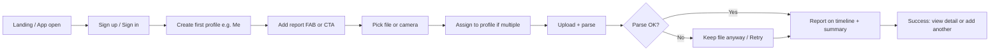
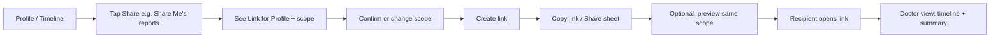
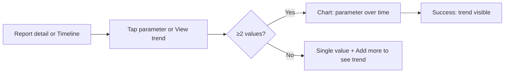

# UX Design Specification doclyzer

**Author:** Vishnu
**Date:** 2026-03-01

---

## Executive Summary

### Project Vision

Doclyzer is a product of **Envsoft Solutions LLP**. It is a patient-facing product that gives users one place to store, organise, and understand their medical reports. Users create patient profiles (self, family), upload PDF reports per profile, and get timelines, trend charts (especially for blood/lab), and AI summaries and insights—with lifestyle and natural-remedy suggestions and clear “not medical advice” disclaimers. The defining UX moment is **sharing**: a link that opens a clean web page for doctors or family, no app required. The product is mobile-first (Flutter), with a NestJS backend and a separate share web experience; AI and parsing use open-source/local models (e.g. Hugging Face, Docling) where possible. Observability: Crashlytics, app analytics (no PHI), and SEO-friendly landing page.

### Target Users

- **Primary (v1):** Chronic self-manager—recurring labs (e.g. diabetes, thyroid, lipids); wants trends, summaries, and one clear share link for doctors. Tech comfort varies; often on mobile.
- **Secondary (core from day one):** Family carer—manages multiple profiles (self + others); uploads and shares per profile; needs quick profile switching and per-profile share links.
- **Later:** One-off / “health scare” user (few reports; quick summary and one share). **Share recipient:** Doctor or family; uses only the share link in a browser; no account.

### Key Design Challenges

- **Trust and disclaimers:** Surfaces must clearly frame AI outputs (summaries, lifestyle suggestions) as informational only, not medical advice; region-aware where needed.
- **Multi-profile mental model:** Users must easily understand “which profile am I in?”, assign reports to the right profile, and switch context without confusion.
- **Onboarding to first value:** Getting from signup to “I see my report summarised / my first chart” in minimal steps; avoiding drop-off before first upload or first share.
- **PHI-safe instrumentation:** Crashlytics and analytics must never send PHI; event design and custom keys must be anonymised and compliant (e.g. GDPR consent where required).
- **Share flow clarity:** Creating a share link, choosing what’s included (profile/reports), copying or sending the link, and revoking/expiry—all must be obvious and low-friction.

### Design Opportunities

- **Share link as viral wedge:** Frictionless “copy link” and “open in browser” experience; recipient sees a doctor-friendly, print-ready page—drives signups and retention.
- **Blood-first charts as “aha”:** First time a user sees a trend (e.g. Hb over time) in one place is a strong moment to reinforce value and upgrade intent.
- **Lifestyle suggestions with clear framing:** Cards or sections that feel helpful and personal (from their data) while always tagged as “informational only” and “talk to your doctor.”
- **Landing and SEO:** Clear value prop, keywords, and structured content so the marketing site ranks for “medical report organizer,” “share lab reports with doctor,” etc.

---

## Core User Experience

### Defining Experience

The core loop is: **upload report → assign to profile → see timeline/charts/summary → (optionally) create share link**. The one thing users do most is **upload and organise reports**; the critical interaction to get right is **first upload → first parsed summary or chart** and **first share link created and opened by recipient**. Success is when the user sees their data in one place and can share it with a doctor in one tap.

### Platform Strategy

- **Primary:** Flutter mobile app (iOS and Android); touch-first. Share experience is a **web app** (separate from the Flutter app) so recipients need no install.
- **Landing/marketing:** SEO-optimised web site (e.g. doclyzer.com) for discovery and signup; legal pages (Terms, Privacy, Refund) linked from app and site.
- **Offline / cache:** Post-MVP; not in initial UX scope.
- **Device capabilities:** Camera/upload, clipboard for share link; no DICOM or device health APIs in v1.

### Effortless Interactions

- **Upload + assign:** As few steps as possible: pick file (or camera) → choose profile → done; parsing and summary appear without extra taps.
- **Share link:** Create link → choose what’s included (default: current profile) → copy link or share via system share sheet; optional expiry/revoke visible in one place.
- **Profile switch:** Clear profile selector (e.g. tab or drawer); timeline and charts always scoped to selected profile; no ambiguity.
- **Viewing a trend:** From timeline or report detail, one tap to see parameter over time (e.g. Hb); chart is default view for lab parameters where applicable.

### Critical Success Moments

- **First report parsed:** User sees summary (and, for lab, structured values) immediately after upload—no “we’ll email you” delay.
- **First trend chart:** User sees a meaningful trend (e.g. same test over time) and understands “this is my history in one place.”
- **First share link opened by recipient:** North-star moment; recipient (e.g. doctor) views the shared page; user gets value from sharing and may return or upgrade.
- **First lifestyle/insight (paid):** User sees a suggestion grounded in their report and can mark it helpful; reinforces that the product “understands” their data (with disclaimers).

### Experience Principles

- **Patient-owned and transparent:** User always knows what data they have, which profile it’s in, and who can see it via share links; no hidden use of PHI.
- **Minimal steps to value:** Optimise for “upload → see result” and “create share link → copy/send” in the fewest taps.
- **Share-first:** Design the share flow and share page as a first-class experience (doctor view, print-friendly, clear branding).
- **No PHI in product analytics:** All analytics and crash reporting are event-based and anonymised; no report content or identifiers in events.
- **Clear “not medical advice”:** Every AI-generated summary, insight, or lifestyle suggestion is accompanied by visible disclaimers and, where relevant, region-specific wording.

---

## Desired Emotional Response

### Primary Emotional Goals

- **In control and organised:** Users should feel that their health information is finally in one place and under their control—no more scattered PDFs or lost reports. The product reduces chaos and creates a sense of order.
- **Confident when sharing:** When creating or sending a share link (e.g. to a doctor), users should feel prepared and professional—"I have my history ready" rather than anxious about missing something.
- **Informed, not anxious:** After viewing summaries and trends, users should feel better informed about their results (and, where applicable, lifestyle suggestions) without replacing medical advice—clarity and reassurance, not false certainty or alarm.
- **Trust in the product:** Users must feel that their sensitive data is handled responsibly; transparency (who can see what, clear disclaimers, no PHI in analytics) supports trust.

### Emotional Journey Mapping

- **Discovery/onboarding:** Curious and hopeful—"this could solve my report mess"; avoid overwhelm (keep signup and first-upload flow short so they reach value quickly).
- **First upload and summary:** Relief and slight delight—"it understood my report"; confidence that the product works for them.
- **Viewing a trend chart:** "Aha" moment—empowerment from seeing their own data in one place; motivates continued use and sharing.
- **Creating/sending share link:** Confidence and readiness—"I'm prepared for my appointment"; for the recipient, clarity and professionalism.
- **When something goes wrong (e.g. parse failure, error):** Avoid frustration and distrust; clear messaging, recovery options, and no blame ("we couldn’t read this format" vs "your file is invalid").
- **Returning user:** Familiar and efficient—"I know where everything is"; low friction to add a new report or check a trend.

### Micro-Emotions

- **Confidence over confusion:** Clear labels, obvious "which profile am I in?", predictable flows (upload → assign → see result) so users rarely feel lost.
- **Trust over skepticism:** Explicit disclaimers (not medical advice), visible control over sharing and data, and no dark patterns—build trust through honesty and control.
- **Accomplishment over frustration:** Success moments (first summary, first chart, first share) surfaced clearly; errors and limits (e.g. upload cap) explained plainly with a path forward (e.g. upgrade).
- **Calm over anxiety:** Tone and visuals should feel calm and professional; avoid alarmist language around results; lifestyle suggestions framed as "consider discussing with your doctor" not as prescriptions.

### Design Implications

- **In control:** One clear "home" (timeline/dashboard per profile); easy profile switch; visible "what’s shared" and revoke; simple data/account controls in settings.
- **Confident when sharing:** Share flow with a clear "preview" or "what the doctor will see"; copy link and share sheet prominent; optional short message or expiry so users feel in charge.
- **Informed, not anxious:** Summaries and insights in plain language; reference ranges and trends explained; every AI output paired with a visible "informational only / talk to your doctor" line.
- **Trust:** Privacy policy and terms accessible; no hidden data use; consent for analytics where required; error states that explain and offer next steps.

### Emotional Design Principles

- **Clarity over cleverness:** Prefer clear, consistent language and flows over novelty; medical context demands reliability.
- **Empower without overpromising:** Help users feel capable and informed while never implying the product replaces a healthcare provider.
- **Reduce friction at high-emotion moments:** First upload, first share, and hitting a limit (e.g. cap) are key moments—design for minimal friction and clear next steps.
- **Consistent, calm tone:** Copy and UI tone should be professional, reassuring, and inclusive (e.g. family carers, different literacy levels).

---

## UX Pattern Analysis & Inspiration

### Inspiring Products Analysis

- **Health / fitness trackers (e.g. Apple Health, Google Fit, or regional lab apps):** Strong patterns for timeline and trend visualisation; clear parameter names and reference ranges; "add data" flows that feel quick. Lessons: one-tap to see a trend, minimal steps to log or upload; avoid medical jargon in labels where possible.
- **Document / file organisers (e.g. Google Drive, Dropbox, Notion):** Folder/project mental model, share links, "preview then share." Lessons: share link as first-class action; clear "who has access"; revoke and expiry without hunting in settings. Doclyzer adapts this for reports and profiles instead of folders.
- **Family / multi-profile apps (e.g. family plan UIs, shared calendars):** Profile switcher that’s always visible; context clearly indicated (e.g. "Viewing: Mom’s reports"). Lessons: profile selector in nav or header; no ambiguity about whose data is on screen; adding a profile is simple and guided.
- **Doctor/patient portals and lab result viewers:** Clean, scannable result layout; date-first ordering; print-friendly summary view. Lessons: share page should feel "doctor-ready"—timeline, key values, one-page summary; minimal branding, high readability.
- **Consumer health apps with insights (e.g. sleep or nutrition apps):** Cards for tips and suggestions with clear "this is not medical advice" and "learn more." Lessons: separate insight/suggestion blocks from raw data; consistent disclaimer placement; tone that informs without alarming.

### Transferable UX Patterns

- **Navigation:** Bottom nav or tab bar with clear primary destinations (e.g. Home/Timeline, Reports, Share, Profile/Settings); profile switcher in header or drawer so "whose data" is always obvious.
- **Upload flow:** Single flow: pick file or camera → choose profile → done; progress/parsing state visible (e.g. "Reading report…"); result (summary + chart hint) on same or next screen—no "we’ll email you."
- **Share flow:** One primary CTA: "Create share link" or "Share this profile"; preview of what recipient sees; prominent "Copy link" and system share; manage/revoke/expiry in one place (e.g. Share or Settings).
- **Trend/chart entry:** From report detail or timeline, tap a parameter (e.g. Hb) → see chart over time; optional "Compare with prior" later. Chart as default for lab parameters where multiple values exist.
- **Visual:** Clean, high-contrast typography; calm colour palette; cards for reports and insights; doctor-view share page: minimal chrome, print-friendly, semantic structure (headings, tables) for accessibility and SEO.

### Anti-Patterns to Avoid

- **Hiding "whose data":** Avoid showing reports or charts without clear profile context; never leave the user guessing whether they’re viewing their own or a family member’s data.
- **Share link buried or complex:** Avoid multi-step share dialogs or making revoke/expiry hard to find; share should feel as simple as "copy link" and "see what they see."
- **Medical jargon without explanation:** Avoid raw codes or abbreviations (e.g. "HbA1c") without a plain-language label or tooltip where it helps; balance brevity for power users with clarity for others.
- **Alarmist or definitive language:** Avoid framing AI summaries or lifestyle suggestions as diagnoses or prescriptions; no red/yellow styling that implies "danger" without context (prefer "above range" + reference and disclaimer).
- **Heavy onboarding before value:** Avoid long signup forms or tutorials before first upload; get to "your first report summarised" or "your first share link" in minimal steps.
- **Cluttered share page:** Avoid marketing-heavy or app-centric layout on the doctor-facing share page; keep it scannable, professional, and print-friendly.

### Design Inspiration Strategy

- **Adopt:** Timeline + trend chart pattern from health apps; share-link-and-previews from document apps; profile switcher and "current context" from multi-profile UIs; card-based insights with disclaimers from consumer health apps; print-friendly, minimal share view from patient-portal patterns.
- **Adapt:** "Folder" → "profile" and "file" → "report"; "share folder" → "share profile (or selection)"; lab-specific normalisation and reference ranges for charts (not generic fitness metrics).
- **Avoid:** Long onboarding before first value; share flow that requires multiple screens or unclear preview; any UI that obscures which profile’s data is shown; use of PHI in analytics or crash reports; alarmist or diagnostic language in AI output.

---

## Design System Foundation

### 1.1 Design System Choice

- **Flutter app (mobile):** **Material Design 3** (Material You) as the base design system, with a custom theme. Use Flutter’s built-in Material 3 components and theming (ThemeData, ColorScheme, Typography) for consistency, accessibility, and fast iteration. Option to align with platform (e.g. Material on Android, consider Cupertino or Material with platform-adjusted styling on iOS) while keeping one codebase.
- **Share web app + landing/marketing site:** **Tailwind CSS** as the utility-first foundation; optional component layer (e.g. Headless UI, Radix, or a small custom set) for share page and landing. Enables minimal, print-friendly share page and SEO-friendly landing without heavy framework lock-in. Share design tokens (colour palette, type scale, spacing) with the Flutter app via a shared design-tokens doc or Tailwind config that mirrors the app’s theme.

### Rationale for Selection

- **Flutter + Material 3:** Default and well-supported for Flutter; good accessibility and component coverage; theming allows a calm, professional, Doclyzer-specific look without building every component from scratch. Fits “balance of speed and consistency” and supports mobile-first, touch-based UX.
- **Web: Tailwind:** Fast to build and iterate; easy to keep the share page minimal (few classes, no heavy UI framework). Design tokens (colours, spacing, typography) can be defined once and used in Tailwind config and in Flutter theme so app and web feel aligned. No requirement for a full component library on the share/landing side—custom components where needed (e.g. report card, chart, disclaimer block).

### Implementation Approach

- **App:** Define a single ThemeData (Material 3) with Doclyzer colour scheme (primary, surface, error, etc.), typography scale, and component overrides (e.g. card elevation, button style). Use Material components (AppBar, Card, ListTile, FAB, BottomNavigationBar, dialogs) and custom widgets only where the pattern isn’t covered (e.g. report timeline, chart, share preview). Document key tokens (hex/code values) for cross-platform reference.
- **Web:** Tailwind config with same semantic colours and type scale (e.g. `--color-primary`, `--font-sans`). Share page: semantic HTML, minimal layout, print styles; landing: same tokens + marketing components. Optional design-tokens export (JSON or CSS variables) shared from a single source of truth for both platforms.

### Customization Strategy

- **Brand:** Calm, professional palette (e.g. soft primary, neutral backgrounds, clear text); avoid clinical “hospital” sterility or alarm colours for normal states. Use a single accent for CTAs and key actions; reserve red/warning for true errors or out-of-range where appropriate and paired with disclaimers.
- **Components:** Extend Material/Tailwind only where needed: report cards, timeline item, trend chart, share-preview block, disclaimer banner. Keep naming and structure consistent (e.g. “insight card” pattern on app and web).
- **Accessibility:** Rely on Material 3 and semantic HTML for baseline (focus, contrast, labels); ensure touch targets and font scaling; test share page with screen readers and print.
- **Future:** If the team adds a full design system (Figma library, token pipeline), formalise tokens and document component usage; current choices (Material 3 + Tailwind) support that evolution.

---

## 2. Core User Experience (Defining Interaction)

### 2.1 Defining Experience

**The defining experience:** *"One place for all my reports—one link to share with my doctor."* The core interaction users will describe is: upload reports → see them organised by profile and time → create a share link → send it before an appointment. If we nail this loop (upload → organise → share), retention and word-of-mouth follow. The "magic" moment is when the recipient (e.g. doctor) opens the link and sees a clear, print-ready view of the patient’s history—no app install, no login. Secondary defining moment: seeing a **trend chart** (e.g. Hb over time) for the first time—"my history in one place."

### 2.2 User Mental Model

- **Current behaviour:** Users keep PDFs in email, downloads, or paper; share by forwarding files or carrying printouts. Mental model: "I have a pile of reports; I need to show the right ones to the right person."
- **Expected model:** "I put my reports in one app; I pick whose reports (mine or a family member’s); I get a link that shows what I choose; I send the link." No expectation of real-time sync with hospitals or labs—upload is the primary input.
- **Confusion risks:** Which profile they’re in; what exactly the share link shows (all reports vs selection); whether the link expires or can be revoked. Mitigate with clear labels ("Viewing: Mom’s reports"), an explicit share preview, and a single place to manage/revoke links.
- **Loved from existing solutions:** Quick add (like adding a file to a folder); share link that "just works" for the recipient; trend views that make sense without medical expertise. **Hated:** Long onboarding, unclear what’s shared, alarmist or jargon-heavy presentation.

### 2.3 Success Criteria

- **"This just works":** Upload PDF → assign to profile → summary (and, for lab, chartable data) appears without extra steps or "we’ll email you." Share link creation → copy/send in one or two taps; recipient opens link and sees correct data.
- **User feels successful when:** They’ve sent a share link before an appointment and the doctor has a clear view; or they’ve seen a trend (e.g. Hb) over time in one screen.
- **Feedback that signals success:** Parsing complete + summary visible; "Share link created" + link copied or share sheet open; (optional) "Link opened by recipient" if we track that; chart rendered with at least two data points.
- **Speed:** Parsing feels immediate (seconds, not minutes); share flow is sub–30 seconds from "Share" to "link sent."
- **Automatic:** Assign to default profile (e.g. last used or "Me"); suggest profile if only one; optional "preview what doctor sees" without forcing an extra step.
- **No dead-ends:** Parse failure or unsupported file still results in the report stored and visible (e.g. "Unparsed – view PDF"); user can always share the PDF. First report reaches summary + share in under 2 minutes.
- **Share control and clarity:** User can revoke any share link and see what each link shows (profile + scope) without opening it; optional expiry supports "wrong person opened" recovery.

### 2.4 Novel UX Patterns

- **Mostly established:** Upload → assign to container (profile), timeline, share link, and trend charts are familiar (files + folders, Drive/Dropbox share, health app trends). We combine them in a health-report context with multi-profile and doctor-facing share page.
- **Innovation:** (1) **Profile as the share unit**—share link scoped to a profile (or selection within it), not a generic "folder"; (2) **share page as doctor view**—minimal, print-friendly, no app; (3) **lab-first charts with normalised test names** from heterogeneous PDFs. No radical new gesture or paradigm—familiar patterns with a clear twist.
- **Education:** Minimal. "Create a profile" and "Share this profile" use familiar language. In-app tooltips or one-time hints only if data shows confusion (e.g. "This link shows everything in [Profile name]").

### 2.5 Experience Mechanics

**1. Initiation**

- **Upload:** FAB or "Add report" on timeline/home; system file picker or camera. Optional: "Assign to" pre-selected (current profile or last used).
- **Share:** Share creates a link **for the currently selected profile only**. Entry copy: "Share [Profile name]'s reports" (e.g. "Share Mom's reports"). Prominent from profile/timeline or a dedicated Share tab. If the user is on a screen with no selected profile (e.g. account settings), don't offer Share there, or prompt to choose profile first. Trigger is explicit user action.

**2. Interaction**

- **Upload:** User selects file(s) → chooses profile (if multiple) → upload starts. Progress/parsing state visible ("Reading report…"). Result: report appears on timeline with summary (and lab values/chart hint).
- **Share:** User taps Share → optional "Preview" or "What they’ll see" → before "Create link," show "Link for **[Profile name]**" and scope (All / Last N / date range). User confirms or changes profile/scope, then Create link. Optional "Preview" shows the same profile and scope. Copy link and/or system share sheet. Optional: set expiry, add short message. Manage: list of active links with revoke/copy; each link shows profile name and scope.

**3. Feedback**

- **Upload:** Success = report card on timeline + summary visible; failure = clear message ("We couldn’t read this format") + retry or skip. No blame ("your file is invalid"). On parse failure: offer "Keep file anyway" so report appears as unparsed with PDF link.
- **Share:** Success = link copied and/or share sheet; optional confirmation "Link created." Revoke = link invalidated; user can create a new one. Manage: each link displays profile name and scope (e.g. "All reports" or "Last 6 months") so user knows what the link shows.

**4. Completion**

- **Upload:** Done when report appears in timeline with summary; next = view detail or add another.
- **Share:** Done when user has sent the link (or copied it). Next = recipient opens link (north-star); user can return to manage links or add more reports.

### 2.6 Edge Cases & What-If Handling

- **Many reports in one profile:** Timeline and share page support many items without feeling slow or overwhelming—e.g. timeline virtualised or grouped by date; share page optionally "last N reports" or "date range" so user can share a subset. Mechanics: "Share all" vs "Share recent" or similar control where scope is clear.
- **Wrong person opens share link:** User can revoke immediately; optional expiry and (post-MVP) "notify when opened." Copy and UI make "Revoke" and "Link revoked" obvious. Success: user understands who could have seen the data and can invalidate the link.
- **Parse failure (unreadable PDF):** Never dead-end. Message: "We couldn't read this format." Options: retry or "Keep file anyway" (store PDF, show as "Unparsed – view PDF" on timeline). Report always appears on timeline with at least upload date and PDF link.
- **First-time user with one report:** Single report still gets summary and share. Empty states: "Add more to see trends"; "Your next report will appear here." Success: first report → summary + share link possible in under 2 minutes.
- **Power user, many profiles:** Share management shows which profile (and scope) each link represents. Profile switcher always visible; creating a share link clearly labeled e.g. "Share link for [Profile name]." User can answer "What does this link show?" without opening it.
- **Share page on low bandwidth or print:** Share page minimal (critical content in HTML, minimal JS); print styles (hide nav, expand content). Success: page loads and prints reliably on slow networks.
- **Duplicate upload (same report twice):** Duplicate detection (e.g. file hash); treat as "Already added" with option "Add anyway" or replace. Avoid duplicate entries in timeline and charts unless user explicitly re-adds.

### 2.7 Stress-Tested Requirements

- **Share management:** Each link shows profile + scope in one line; with 3+ links, support sort/filter by profile. Revoke lives in the same place as the link list (Share / Manage). Copy: "This link will stop working. You can create a new one." Optional: "Revoke and create new link" for quick replacement.
- **Parse failure:** "Keep file anyway" plus option to "Replace file" (re-upload same slot). Unparsed card shows upload date + "View PDF" only; no implied promise of future auto-parse.
- **Duplicate handling:** Prefer content fingerprint where feasible; offer "Add anyway" (second entry) or "Replace existing" (update in place) so user can refresh a report (e.g. corrected PDF).
- **Share scope:** At least "All" and "Last N / date range"; post-MVP consider "Choose reports" (e.g. checkboxes) for a custom set per link.
- **Profile visibility:** When more than one profile exists, profile switcher is in app bar or persistent nav (not only in drawer/settings). Share flow shows current profile in the same step as "Create link."
- **Share preview:** Before "Create link," show preview (or one-tap "Preview") of what the recipient will see. Default to showing preview; allow "Skip" only if we have evidence it's safe.
- **Doctor-view success:** Recipient sees timeline + summary + key values; first meaningful paint &lt;3 s on 3G; print preserves layout (one page or paginated); no critical content behind JS.
- **Wrong profile shared:** Share is always scoped to the currently selected profile. Share flow shows "Link for [Profile name]" and scope before Create link; preview uses that same profile and scope so the user cannot create a link for a different profile by mistake.

---

## Visual Design Foundation

### Color System

- **Direction:** Calm, professional, trustworthy. No clinical sterility (e.g. harsh white/blue); no alarm colours for normal states. Single primary accent for CTAs and key actions; reserve red/warning for true errors or out-of-range values, always paired with disclaimers.
- **Semantic mapping:** Primary (brand/CTAs), secondary (secondary actions, links), surface/background (cards, screens), on-surface (text), outline (borders, dividers), error (errors, destructive), success (success states), warning (caution, out-of-range with context). Same tokens in Flutter ThemeData and Tailwind config (e.g. `--color-primary`, `primary` in ColorScheme).
- **Accessibility:** Minimum contrast 4.5:1 for body text, 3:1 for large text and UI components (WCAG AA). Avoid colour as the only differentiator for status (e.g. out-of-range: use icon/label + colour). Document hex/code values in a shared tokens doc for app and web.

### Typography System

- **Tone:** Professional, readable, approachable. Supports headings (screen titles, section headers), body (summaries, report text), captions/labels (dates, metadata, chart labels), and UI (buttons, nav). Long-form reading on report and share pages; headings and short copy elsewhere.
- **Scale:** Define a type scale (e.g. display, h1–h4, body large/regular/small, caption, label). Flutter: Typography and TextTheme; web: Tailwind font-size utilities or CSS custom properties aligned to the same scale. Line height and letter-spacing for readability (e.g. body 1.5, headings tighter).
- **Fonts:** Primary: one clear sans (e.g. system stack or brand font) for UI and body. Optional secondary for marketing/landing. Prefer variable fonts or a small subset to keep payload small on web. Support system font scaling (accessibility).

### Spacing & Layout Foundation

- **Base unit:** 4px or 8px base grid. Consistent spacing scale (e.g. 4, 8, 12, 16, 24, 32, 48) for padding, margins, and gaps. Use same scale in Flutter (padding/margin values) and Tailwind (spacing config).
- **Density:** Balanced—not dense; enough whitespace for cards, list items, and share page so content breathes. Report cards and timeline items get consistent vertical rhythm; share page clean and scannable.
- **Grid:** App: flexible column/layout for list and detail; share page: single column or simple multi-column for summary + timeline. No heavy grid requirement for MVP; align to Material layout and Tailwind container/stack patterns.

### Accessibility Considerations

- **Contrast:** All text and interactive elements meet WCAG AA (4.5:1 or 3:1 as above). Check primary and error colours against background.
- **Touch targets:** Minimum 44×44 pt (iOS) / 48×48 dp (Material) for tap targets. Spacing between tappable elements to avoid mis-taps.
- **Focus and labels:** Visible focus indicators; all controls have accessible names. Share page: semantic HTML (headings, landmarks, table captions where applicable); screen reader and keyboard navigable.
- **Font scaling:** Respect system font size; body and UI scale without breaking layout. Test at 200% zoom on web.
- **Print:** Share page print styles: hide nav/chrome, expand content, sufficient contrast when printed.

### Design Principles (First Principles)

- **Trust:** Visual design is predictable and clear; no styling that implies medical authority we don't have. One primary action colour; secondary actions visually secondary. Errors and warnings are distinct and used sparingly; red/warning only for real error or out-of-range, always with label/icon and disclaimer. Consistent component patterns (links, cards, buttons) so the product feels honest and reliable.
- **Readability:** All body and UI text meets WCAG AA contrast. Clear hierarchy in every context (one title level, one body, one supporting/caption). Share page and report content are legible on desktop and mobile without zoom; print preserves hierarchy and contrast.
- **Calm:** No alarm styling in normal state. Neutral backgrounds and surfaces; avoid high saturation or busy pattern. Single primary accent for key actions; rest of palette restrained.
- **Implementation:** One set of design tokens (colour, type, spacing) for app and web so the product feels unified. Touch targets and focus states meet accessibility requirements; type scales with system settings.

---

## Design Direction Decision

### Design Directions Explored

- **Direction A — Calm default:** Soft primary (e.g. teal/slate), neutral surfaces, ample whitespace, single accent for CTAs. Aligns with Visual Foundation and first principles (trust, readability, calm). Best fit for “professional, not clinical.”
- **Direction B — Warm minimal:** Slightly warmer neutral (off-white/cream), same single accent (e.g. soft blue or green), slightly tighter spacing. Still calm; slightly more approachable.
- **Direction C — Higher contrast:** Darker text on light, stronger primary for CTAs, same hierarchy. Emphasises readability and accessibility; may feel slightly more “productivity” than “wellness.”
- **Locked-in foundation:** Material 3 (app) + Tailwind (web); 4/8px spacing; type scale with one primary sans; WCAG AA; share page minimal and print-friendly. All directions use this foundation; variation is in accent hue, warmth, and density.

### Chosen Direction

- **Primary:** **Direction A (Calm default)** — soft primary accent, neutral backgrounds, balanced density, single CTA colour. Supports trust and “informed, not anxious” without feeling cold or clinical.
- **Refinements:** Share page and doctor view use the same tokens with minimal chrome (Direction A applied to web); app and share feel one product. Optional: Direction B warmth can be introduced later via a light theme variant if needed.

### Design Rationale

- **Trust and clarity:** Calm default reinforces “we’re not a hospital, we’re your organiser”; one accent reduces cognitive load and supports clear primary actions (e.g. Share, Add report).
- **Readability:** Neutral surfaces and sufficient contrast support long reading (summaries, report text) and scanability (timeline, share page). No alarm colours in normal state.
- **Consistency:** One direction across app and web (including share page) so the product feels unified; Material 3 and Tailwind tokens aligned to the same palette and scale.
- **First-principles check:** Trust requires predictable UI and no false authority; readability requires contrast and hierarchy. Direction A is the minimal set (one accent, neutrals, type scale, spacing) that satisfies both; no additional visual treatment is required for MVP.

### Implementation Approach

- **App (Flutter):** ThemeData with ColorScheme and Typography matching Direction A (primary, surface, on-surface, etc.). Use Material 3 components; custom widgets only for report card, timeline, chart, share preview.
- **Web (share + landing):** Tailwind config with same semantic colours and type scale; share page uses minimal layout and print styles; landing can use the same tokens with marketing components.
- **Share page (doctor view):** Apply Direction A tokens only. No primary-colour CTAs; text and subtle borders so it reads as a report, not an app. Profile/patient context (e.g. "Reports for [Name]") in a consistent, prominent position (e.g. top of content).
- **Print (share page):** Print styles ensure strong contrast (dark text on white); hierarchy clear in grayscale; avoid colour-only differentiation.
- **Accessibility:** Type scale and spacing support system font scaling and 200% zoom without clipping; share page remains readable at 200% zoom.
- **Design tokens:** Document primary, surface, error, success, etc. (hex/code) in a single tokens doc or config; reference from both Flutter theme and Tailwind. Optional: generate CSS variables or JSON for design-dev handoff.
- **Showcase:** See `_bmad-output/planning-artifacts/ux-design-directions.html` for visual direction comparison (open in browser). **Future:** Dark mode (post-MVP): second token set with same semantics as Direction A.

---

## User Journey Flows

### Journey 1: Signup to first report (onboarding)

**Goal:** User reaches "I see my report summarised" in minimal steps. Entry: app open or landing CTA. Success: at least one report on timeline with summary (and, for lab, structured data or chart hint).



**Entry points:** App install → sign up; or landing "Get started" → sign up. **Decisions:** Profile name (default "Me"); file source (gallery/camera). **Feedback:** "Reading report…" then report card + summary. **Recovery:** Parse failure → "We couldn't read this format" + Keep file anyway or Retry. **Empty state:** First-time empty timeline: single CTA "Add your first report"; optional line "Share with your doctor after adding reports." No Share CTA until ≥1 report exists. **Share trigger:** After ≥1 report, optional one-time or contextual hint "Share [Profile]'s reports before your visit" from timeline or report detail (dismissible).

### Journey 2: Upload and assign report (core loop)

**Goal:** Add a new report to the right profile and see it on the timeline with summary. Entry: timeline/home with "Add report" or FAB.

```mermaid
flowchart LR
  A[Timeline / Home] --> B[Tap Add report]
  B --> C{At report cap?}
  C -->|Yes| D[Show upgrade or remove report]
  C -->|No| E[Select file(s) or camera]
  E --> F{Profiles > 1?}
  F -->|No| G[Upload to default]
  F -->|Yes| H[Choose profile]
  H --> G
  G --> I[Parse in progress]
  I --> J[Report card(s) on timeline]
  J --> K[Optional: view detail / chart]
```

**Decisions:** Which profile (pre-filled current). **Feedback:** Progress → report card(s). **Edge:** Duplicate → "Already added" + Add anyway or Replace. **At cap (Free):** Message "You've reached the Free limit (e.g. 10 reports). Upgrade for more or remove a report" + link to upgrade or manage reports. **Multi-file:** Upload all → assign once to profile (or prompt per file); progress "Adding N reports…" then N cards on timeline.

**Backend parse flow and user status (V1):** Backend receives upload → stores PDF → calls parser (Docling) → saves parsed data or marks `unparsed` on failure. User must always see what’s happening: (1) **Uploading…** during upload; (2) **Reading report…** while backend is parsing (sync or async); (3) **Success:** report card with summary on timeline; (4) **Parse failed:** message “We couldn’t read this format. Your file is saved.” with **Retry** and **Keep file anyway** (card appears as “Unparsed – view PDF”). Fail recovery: parser timeout or error → one retry server-side; then store as unparsed and return same options to user. See product brief “Report upload, parse flow, and user status (V1)” for full backend detail.

### Journey 3: Create and send share link

**Goal:** User creates a link for the current profile (and scope), previews if needed, copies/sends the link. Recipient opens and sees the right data.



**Entry:** Share CTA from **timeline or report detail** (scoped to current profile). First line user sees: "Share [Profile name]'s reports." **Two labels:** "Sharing **[Profile name]**'s reports" (who) and "What to include: All / Last 6 months" (scope). **Decisions:** Scope (All / Last N / date range). **Feedback:** "Link created", link copied. **Recovery:** Revoke → confirm "Link will stop working. You can create a new one" → create new link **for the correct profile**. **Expired/revoked link:** Recipient sees "This link is no longer available"; user creates new link from app.

### Journey 4: View trend chart (lab)

**Goal:** User sees a parameter (e.g. Hb) over time. Entry: report detail or timeline (tap parameter or "View trend").



**Feedback:** Chart with axes and points; or empty state "Add more reports to see trend."

### Journey Patterns

- **Navigation:** Bottom nav or tabs (e.g. Home/Timeline, Reports, Share, Profile). Profile switcher in app bar when >1 profile. Share and Upload are primary CTAs from timeline and (Share) from report detail; first screen of share flow shows "Share [Profile name]'s reports."
- **Decisions:** One active choice per step where possible (e.g. profile picker once; scope picker in share flow). Defaults: current profile, last-used scope.
- **Feedback:** Progress for async actions (parsing); success = card or link visible; errors with clear copy and retry or "Keep file anyway."
- **Recovery:** Parse failure → Keep file anyway (unparsed card). Wrong profile → revoke link, create new. Duplicate → Add anyway or Replace.

### Flow Optimization Principles

- **Minimize steps to value:** Signup → first profile → first upload in three steps; share flow: Share → confirm scope → Create → Copy (no extra screens).
- **Reduce cognitive load:** Pre-fill profile and scope; show "Link for [Profile name]" before Create; profile always visible when >1.
- **Clear feedback and progress:** Parsing state visible; "Link created" and link copied; chart or empty state for trend.
- **Handle errors without blame:** "We couldn't read this format"; "Already added"; revoke and create new link.
- **Consistency:** Same pattern for "add" (report, profile); same pattern for "share" (confirm → create → copy); same place for "manage" (links, profiles).
- **Surface share at moment of need:** e.g. hint after first reports or from report detail before a visit; don't rely only on persistent Share CTA.

### Other feature flows (beyond share)

- **AI (summary, chat, lifestyle):** **View summary:** After parse, report card shows summary; user taps to expand or see in detail. **Chat (paid):** Entry from report or profile; user asks question; backend calls LLM with report context; response + disclaimer. **Lifestyle suggestions (paid):** Cards on report or profile view; "Consider discussing with your doctor"; thumbs up/down. All AI surfaces: visible "Informational only" and "Talk to your doctor." Flow: user in context (report/profile) → request (summary already shown; chat/suggest on tap) → loading state → result + disclaimer.
- **Subscriptions & promo:** **Upgrade flow:** Entry from cap hit, settings, or paywall. Show plan comparison; select plan; checkout (platform or Stripe/etc.); confirm. **Promo code:** Field at checkout; validate; discount applied; redemption logged (superadmin tracks). **Manage subscription:** Settings → Subscription → current plan, renew, cancel, or change plan.
- **Superadmin:** **Login:** Secured admin auth (e.g. SSO/MFA). **Plan table:** List plans → Edit limits (report cap, share links, file size, price) and save; changes apply per product rule; audit log. **Promo CRUD:** Add (create) new codes, Edit/Deactivate; list codes and view redemptions (who, when, plan). **Analytics:** Dashboard: signups, active users, subscriptions by plan, MRR/ARR, promo redemptions; filters (time, region). **No PHI:** Only account-level and aggregate data; audit log of admin actions.

---

## Component Strategy

### Design System Components

- **From Material 3 (Flutter):** AppBar, BottomNavigationBar, FAB, Card, ListTile, TextField, Button, Dialog, SnackBar, Chip, Divider, ProgressIndicator. Use for nav, lists, forms, feedback. ThemeData (ColorScheme, Typography) from Direction A.
- **From Tailwind (web):** Utility classes for share page and landing; container, flex, grid, typography, spacing, colours from tokens. Optional: Headless UI or Radix for share page (e.g. accordion for report sections).

### Custom Components

- **Report card:** Purpose: show one report on timeline (date, type, summary snippet, optional chart hint). Content: date, title, one-line summary, "View" / tap. States: default, loading (parsing), unparsed (View PDF only), error. Variants: compact (timeline), expanded (detail). Accessibility: role, label, focus order.
- **Timeline / report list:** Purpose: ordered list of report cards per profile. Content: scrollable list (virtualised if many). Actions: tap card → detail; FAB or CTA → Add report. States: empty (Add first report), loading, populated.
- **Share flow block:** Purpose: "Link for [Profile]", scope selector, Create link, Copy/Share. Content: profile name, scope (All / Last N), preview link. Actions: confirm, create, copy, share sheet. States: idle, creating, created, error.
- **Trend chart:** Purpose: show one parameter over time (e.g. Hb). Content: axes, points, reference range if available. States: loading, data (≥2 points), single point (empty state "Add more to see trend"). Accessibility: label, describe data briefly.
- **Disclaimer banner:** Purpose: "Informational only / Talk to your doctor" near AI output. Content: short text; optional "Learn more" link. Always visible when AI summary, chat, or lifestyle suggestion is shown.

### Component Implementation Strategy

- **App (Flutter):** Use Material 3 widgets for layout and controls; build custom Report card, Timeline, Share block, Trend chart, Disclaimer as composable widgets. Share token and profile scope from state management (e.g. Provider/Riverpod).
- **Web (share page):** Semantic HTML + Tailwind; custom "report card" and "timeline" for doctor view; no primary CTA; print styles. Landing: reuse tokens; marketing components as needed.
- **Consistency:** Same content hierarchy (date, title, summary) in app and share page; same disclaimer text; design tokens shared (colour, type, spacing).

### Implementation Roadmap

- **Phase 1 (core):** Report card, Timeline, Add report flow, Profile switcher, Share flow block (create + copy), Share page (minimal).
- **Phase 2:** Trend chart, Report detail (full summary, PDF view), Disclaimer banner, Subscription/promo at checkout.
- **Phase 3:** Chat UI, Lifestyle suggestion cards, Superadmin dashboard (promo CRUD, analytics), Export PDF pack UI.

---

## UX Consistency Patterns

### Button Hierarchy

- **Primary:** One per screen or block; main action (e.g. “Add report”, “Create link”, “Copy link”, “Buy credits”). Filled button (Material 3 FilledButton / Tailwind primary). Use for: submit, create, confirm, upgrade.
- **Secondary:** Supporting actions (e.g. “Cancel”, “Change scope”, “Retry”). Outlined or text (Material 3 OutlinedButton / TextButton). Same screen can have one primary and one or more secondary.
- **Tertiary / low emphasis:** “Learn more”, “View PDF”, “Keep file anyway”. Text or link style; no strong border.
- **Destructive:** “Revoke link”, “Delete profile”, “Remove report”. Use semantic danger colour; confirm before execution where data is lost.
- **FAB:** Single primary action from timeline (e.g. “Add report”). One FAB per main screen; no FAB on modals or share flow.

### Feedback Patterns

- **Success:** Short SnackBar or inline “Link copied”, “Report added”, “Credits added”. Auto-dismiss (3–5 s) or on next action. No modal for routine success.
- **Error:** Inline or SnackBar with message + optional “Retry” or “Dismiss”. Parse failure: “We couldn’t read this format. Your file is saved.” + actions “Retry” and “Keep file anyway”. Network error: “Something went wrong. Check connection and try again.” + Retry.
- **Warning:** e.g. “You’ve reached the Free limit” with upgrade/manage actions; “This link will stop working” before revoke. Non-blocking where possible.
- **Info / progress:** “Uploading…”, “Reading report…”, “Creating link…” with spinner or linear progress. Clear transition to success or error.
- **Loading states:** Skeleton or spinner for list/timeline; spinner for buttons that trigger async work. Disable primary action while in progress to prevent double submit.

### Form Patterns

- **Profile selection:** Single choice (radio list or dropdown); default = current profile. Required when uploading report if account has multiple profiles.
- **Scope (share):** Single choice (e.g. All / Last 6 months). Default = last used or “All”. No free-text; predefined options only for v1.
- **Checkout (credits/subscription):** Plan or pack selection (cards or list); promo code field with “Apply”; primary “Pay” with amount and currency. Validate promo before submit; show discount and final amount.
- **Validation:** Inline on blur or submit. Required fields: clear “Required” or placeholder hint. Invalid format: message under field; don’t block submit on optional fields. Server errors (e.g. invalid promo): show at top of form or near field.
- **Accessibility:** Labels for all inputs; error messages associated (aria-describedby); focus order follows visual order.

### Navigation Patterns

- **App (Flutter):** Bottom nav for main sections (e.g. Home/Timeline, Reports, Share, Profile). App bar: title, profile switcher (when >1 profile), optional overflow. No nested bottom nav; one level of tabs.
- **Profile switcher:** In app bar or dedicated control; always visible when account has multiple profiles. Selection persists; timeline and share are scoped to selected profile.
- **Share flow:** Linear: Share entry → scope → Create → Copy/Share. Back exits or goes to previous step; no bottom nav inside flow.
- **Web (share page):** No app-style nav; recipient sees single page (timeline + report list). Optional “Print” and “Back to top”. Landing: header with signup/login; footer with legal and product links.

### Modal and Overlay Patterns

- **Dialogs:** Confirm before destructive (revoke link, delete profile). Title + short copy + Primary (e.g. “Revoke”) + Secondary (“Cancel”). Don’t stack modals.
- **Bottom sheet (mobile):** For profile picker, scope picker, or “Copy / Share” actions after link created. Dismissible by swipe or tap outside.
- **Full-screen flows:** Add report (picker → upload → result); Share (scope → create → copy). Use app bar with back; no modal for full flows.

### Empty and Loading States

- **Timeline empty:** “No reports yet. Add your first report to get started.” + primary CTA “Add report”. No chart or share CTA until ≥1 report.
- **Trend empty:** “Add more reports to see trend” when only one value for a parameter.
- **Share:** No Share CTA until user has ≥1 report (rule from journey). After reports: “Share [Profile name]’s reports” as entry.
- **Loading:** Skeleton list for timeline; spinner for single report parsing; progress for multi-file upload (“Adding N reports…”).
- **Error state (report card):** “We couldn’t read this format” with Retry and “Keep file anyway”; card shows as “Unparsed – View PDF”.

### Search and Filter Patterns

- **v1:** Timeline ordered by date (newest first). Optional: filter by report type (e.g. Blood, Imaging) as chips or dropdown—implement if scope allows. No full-text search in MVP.
- **Future:** Search by date range, test name, or keyword; filters in app bar or sheet. Same pattern: chips or dropdowns; apply clears or refines list.

### Design System Integration

- **Material 3 (Flutter):** Buttons, SnackBar, Dialog, TextField, BottomNavigationBar, FAB from M3; custom Report card, Timeline, Share block, Trend chart, Disclaimer use M3 surfaces and typography. Colour and type from Direction A (calm, readable).
- **Tailwind (web):** Share page and landing use utility classes; same semantic colours (primary, surface, error) as tokens. Custom components (report card, timeline) share structure with app for consistency.
- **Custom rules:** One primary CTA per screen; all AI surfaces carry disclaimer; share flow always shows profile name and scope before Create; parsing states always visible (Uploading / Reading report / Done or Failed).

---

## Responsive Design & Accessibility

### Responsive Strategy

- **Primary: Flutter mobile app (iOS/Android)** — Single layout tuned for phone; bottom nav, FAB, list/detail. No separate tablet layout in v1; scale up on tablets with same UI and touch targets.
- **Web: share page + landing** — Share page: single-column, read-only; works on phone and desktop (doctor may view on either). Landing/marketing: responsive; breakpoints for narrow (mobile), medium (tablet), wide (desktop). Header/footer and CTAs adapt; no app-style nav on web.
- **Desktop (share/landing):** Extra width used for readable line length (max-width container), side margins; no multi-column dashboard in v1. Share page: print-friendly (existing Design Direction).
- **Tablet:** App uses same layout as phone; optionally use more of the screen (e.g. list + detail) in a later phase. Web: same breakpoints as landing.

### Breakpoint Strategy

- **Web (Tailwind):** Mobile-first. Use standard breakpoints: default (mobile), `sm` 640px, `md` 768px, `lg` 1024px, `xl` 1280px. Share page: single column at all sizes; landing: stack on small, simple grid or two-column on `md+`.
- **Flutter:** No breakpoints for v1; one layout. Later: use `LayoutBuilder` or responsive packages if we add tablet-specific layouts.
- **Orientation:** Portrait-first for app; landscape supported but not optimized in v1.

### Accessibility Strategy

- **Target: WCAG 2.1 Level AA** where applicable (web share page, landing, and any in-app web views). Flutter: follow platform a11y (Semantics, TalkBack/VoiceOver, sufficient contrast).
- **Contrast:** Text and UI meet 4.5:1 for normal text, 3:1 for large text (and non-text elements). Use Direction A palette; avoid low-contrast combinations.
- **Touch targets:** Minimum 44×44 dp (Material); buttons and list items meet or exceed. FAB and primary actions easy to tap.
- **Keyboard (web):** Share and landing pages navigable by keyboard; visible focus; “Skip to content” or equivalent where useful.
- **Screen readers:** Semantic structure (headings, landmarks, labels). Flutter: semantics for report cards, timeline, share flow, and disclaimer; avoid unlabeled images of text for critical info.
- **Focus and order:** Logical focus order; focus not trapped in modals; dismissible dialogs/sheets with Escape or back.
- **Disclaimers and AI:** Ensure “Informational only / Talk to your doctor” and similar text are exposed to screen readers and not only visual.

### Testing Strategy

- **Responsive:** Test app on at least two phone sizes and one tablet; test share and landing on narrow (320px), 768px, and 1280px. Check overflow and tap targets.
- **Accessibility:** Automated: axe or Lighthouse (web); Flutter semantics and platform a11y checks. Manual: keyboard-only navigation (web); VoiceOver (iOS) and TalkBack (Android) for main flows (upload, timeline, share, view trend).
- **Real devices:** Test on physical devices for touch, zoom, and readability; verify no PHI in visible labels or semantics.

### Implementation Guidelines

- **Web:** Semantic HTML (section, nav, main, headings); relative units (rem, %) and Tailwind spacing; `prefers-reduced-motion` where applicable. Share page: print CSS (already in Design Direction).
- **Flutter:** Use `Semantics` and `ExcludeSemantics` where needed; label icons and images; test with “TalkBack”/“VoiceOver” on. Ensure `Material` theme contrast and touch target sizes.
- **Shared:** One primary action per screen; clear error and success feedback; parsing/loading states announced or visible.

---
